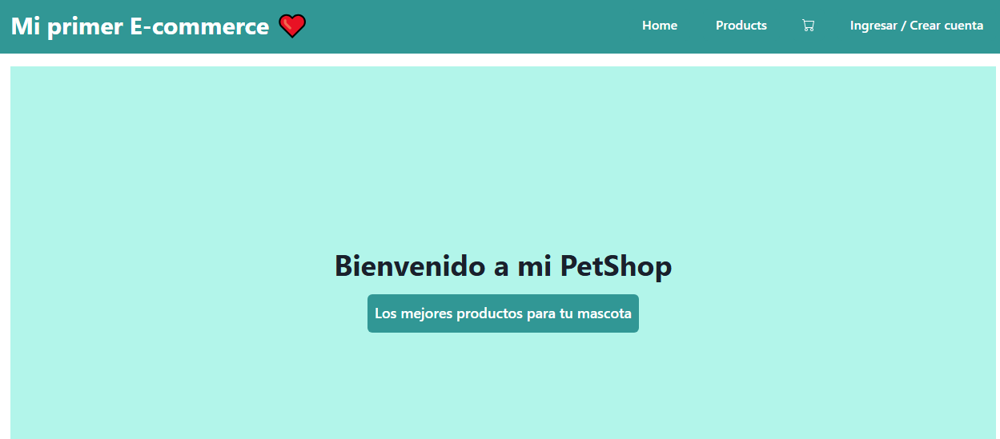
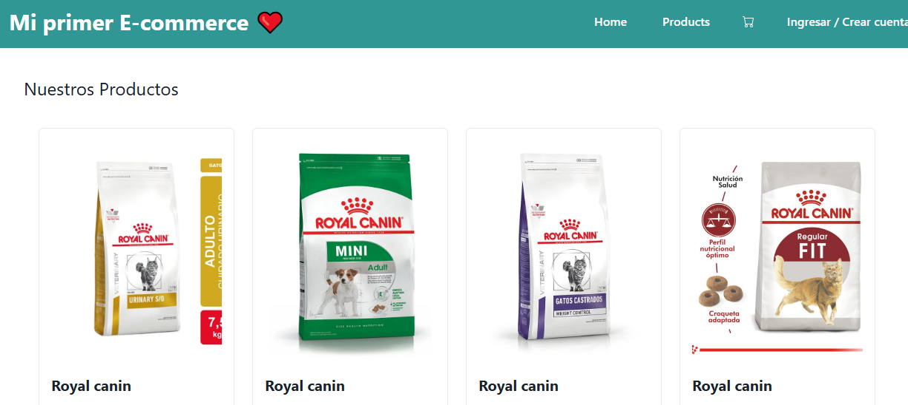
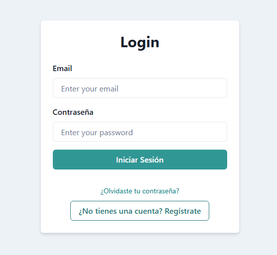

# Bienvenidos a My-first-E-commerce-App 📝✨

**My-first-E-commerce-App** es una app desarrollado con React, Vite, Chakra UI y Firebase, que ofrece productos alimenticios para perros y gatos. La app permite a los usuarios navegar por productos, registrarse, iniciar sesión, agregar productos al carrito y realizar compras. Los usuarios pueden ver sus órdenes y realizar pagos, con las rutas protegidas para garantizar que solo los usuarios autenticados puedan acceder a ciertas secciones.

## Despliegue en Vivo

Puedes ver la aplicación en funcionamiento aquí: [Todo Listo en Firebase](https://mi-primer-e-commerce-c1704.web.app/)

## Características

- **Autenticación: Implementada usando Firebase Authentication (registro, inicio de sesión y recuperación de contraseña).
- **Productos: Los productos son alimentos para perros y gatos, almacenados en Firebase y se muestran en la página principal.
- **Carrito de compras: Los datos del carrito de compras se guardan y despliegan desde Firebase. Los usuarios pueden agregar productos al carrito y ver su contenido.
- **Órdenes: Los usuarios pueden ver el historial de sus órdenes desde la página Orders.
- **Rutas protegidas: Las páginas de Orders y Checkout solo están accesibles para usuarios autenticados.
- **Responsive: La interfaz es completamente adaptativa para móviles, tabletas y escritorios.
## Estructura del Proyecto

src/
  ├── components/
  │   ├── Cart/
  │   ├── Layout/
  │   │   ├── Header/
  │   │   ├── Footer/
  │   │   └── Main/
  │   ├── ProductDetail/
  │   ├── ProductList/
  │   └── OrderSummary/
  ├── context/
  ├── hooks/
  ├── pages/
  │   ├── Home/
  │   ├── Login/
  │   ├── Register/
  │   ├── ForgotPassword/
  │   ├── Orders/
  │   ├── Checkout/
  │   └── NotFound/
  ├── routes/
  └── services/
  App.jsx
  main.jsx
  index.html

## Capturas de Pantalla

### Vista Principal

### Nuestros productos

### login o resgistro nuevo

Tecnologías Utilizadas
Frontend: 
Vite: Para un entorno de desarrollo rápido.
React: Biblioteca para construir interfaces de usuario.
Chakra UI: Biblioteca de componentes para diseño y estilo.
JavaScript (ES6+): Lenguaje principal para la lógica de la aplicación.
Backend: Firebase (Authentication, Firestore, Firebase Storage)

---

## Autor

Este proyecto fue desarrollado por [Cinthia Sosa](https://github.com/Ramlah23/My-first-E-commerce-App.git) 🌟.  
¡Me encantaría saber tu opinión sobre el proyecto! Puedes contactarme en [cinthiainessosa@gmail.com].

## Agradecimientos

- A Aldi mi profe preferida de programacion por su apoyo paciencia y dedicacion❤️.  
- A la comunidad de ADA 💞  por la documentación clara y útil.  

## Licencia

Este proyecto está bajo la Licencia MIT. Consulta el archivo [LICENSE](./LICENSE) para más detalles.

¡Gracias por usar mi App! 📝✨